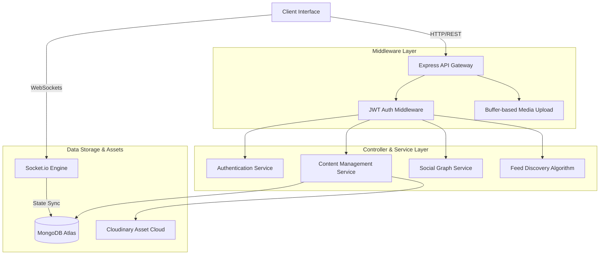

# Buzz 2.0: Professional Networking Architecture

Buzz 2.0 is an enterprise-grade social networking backend engineered for real-time scalability and high-concurrency interactions. The system implements a modular service-oriented architecture, leveraging a hybrid notification engine and an algorithmic feed discovery system to deliver a premium user experience.

## Architecture Overview

The backend follows a strictly decoupled, layered architecture designed to isolate business logic from transport protocols and data persistence layers.



## Request Lifecycle
1.  **Ingress**: The client initiates a request via REST or WebSocket.
2.  **Verification**: The `authMiddleware` extracts and validates the JWT from secure HTTP-only cookies.
3.  **Media Processing**: For content creation, `multer` buffers image data in memory before streaming to Cloudinary.
4.  **Business Logic Orchestration**: The controller invokes specialized services (e.g., `notificationHelper`) to process the request.
5.  **Data Persistence**: Transactions are committed to MongoDB using Mongoose ODM with specialized indexing.
6.  **Real-Time Broadcast**: The `Socket.io` engine identifies recipient Socket IDs and broadcasts updates (e.g., typing status, notifications) with sub-millisecond latency.

## Key Design Decisions

### 1. Engagement-Driven Discovery Algorithm
The "Explore" feed is governed by a multi-factor scoring algorithm in `explore.controller.js`. Unlike linear feeds, Buzz 2.0 ranks content based on:
- **Recency Decay**: Post visibility decreases relative to `createdAt` using a square-root decay function.
- **Engagement Weight**: Likes and comments are weighted (10x and 20x respectively) to prioritize high-value content.
- **Entropy Seeding**: A random factor is injected based on a client-side seed to ensure feed variety across sessions.

### 2. Hybrid Notification Orchestration
Buzz 2.0 implements a dual-delivery notification system. When an interaction occurs:
- **Persistent Storage**: The event is recorded in the `Notification` collection.
- **Socket Dispatch**: The system performs a reverse lookup of the recipient's `socketId` in a global `onlineUsers` map and emits a real-time event if they are active.

### 3. Privacy-First Follow Workflow
The platform supports granular privacy settings. If an account is marked `isPrivate`:
- Follow actions are converted into `FollowRequest` entities.
- Notifications are routed as "Action Required" alerts.
- Data visibility is strictly restricted until the `acceptRequest` transition is triggered.

## Database Schema & Relationships

### Identity & Social Graph
- **User**: The root entity. Manages `followers` and `following` as arrays of `ObjectId` references, enabling performant O(1) membership checks.
- **FollowRequest**: A transitional entity managing the N:M relationship states for private accounts.

### Content & Interaction
- **Post**: Linked to **User** (Author). Contains embedded metadata for `likesCount` and `commentsCount` to optimize read performance.
- **Comment**: A sub-entity linked to both a **Post** and a **User**.
- **Story**: An ephemeral entity with a TTL logic for 24-hour visual updates.

### System Events
- **Message**: Records peer-to-peer communication with delivery status.
- **Notification**: A polymorphic entity tracking Likes, Comments, Mentions, and Follow requests.

## API Documentation (Core Endpoints)

### Authentication & Identity
| Method | Endpoint | Description |
| :--- | :--- | :--- |
| `POST` | `/auth/register` | User instantiation and password hashing. |
| `POST` | `/auth/login` | Secure JWT emission via HTTP-only cookies. |
| `GET` | `/users/:username` | Aggregated profile data and post-history retrieval. |
| `PUT` | `/users/:username` | Profile metadata and avatar update (Cloudinary integration). |

### Content & Feed Discovery
| Method | Endpoint | Description |
| :--- | :--- | :--- |
| `GET` | `/posts/explore` | Algorithmically ranked global content feed. |
| `POST` | `/posts` | Multimedia post creation with memory-buffer upload. |
| `PUT` | `/posts/:postId/like` | Atomic engagement update and notification trigger. |
| `GET` | `/stories` | Active ephemeral content retrieval. |

### Real-Time Communication (Socket Events)
| Event | Direction | Payload |
| :--- | :--- | :--- |
| `addUser` | Client -> Server | User identification for socket mapping. |
| `sendMessage` | Client -> Server | Direct message persistence and dispatch. |
| `typing` | Client -> Server | Presence indicator broadcast. |
| `newNotification` | Server -> Client | Real-time social interaction alert. |

## Tech Stack

### Backend Core
- **Node.js**: Event-driven runtime environment.
- **Express.js**: Middleware-based routing framework.
- **MongoDB & Mongoose**: Distributed document storage and modeling.
- **Socket.io**: Persistent WebSocket orchestration.

### Security & Utilities
- **JWT**: Stateless session management.
- **Bcrypt**: Cryptographic password hashing.
- **Cloudinary**: Cloud-native asset management.
- **Multer**: Multi-part data and buffer handling.

## Project Structure

- `server/controllers`: Implementation of business logic and algorithms.
- `server/models`: Mongoose schema definitions and validation logic.
- `server/routes`: RESTful endpoint definitions and middleware chaining.
- `server/middlewares`: Identity verification and system protection.
- `server/utils`: Helper functions for Cloudinary and real-time alerts.

## Installation & Setup

1. **Repository Configuration**
   ```bash
   git clone https://github.com/Rajeev12R/Buzz2.0.git
   cd Buzz2.0/server
   npm install
   ```

2. **Environment Variables**
   Create a `.env` in the `/server` directory:
   ```env
   PORT=3000
   MONGO_URI=your_mongodb_uri
   JWT_SECRET=your_jwt_secret
   CLOUDINARY_CLOUD_NAME=your_name
   CLOUDINARY_API_KEY=your_key
   CLOUDINARY_API_SECRET=your_secret
   CLIENT_URL=http://localhost:5173
   ```

3. **System Execution**
   ```bash
   npm start
   ```
